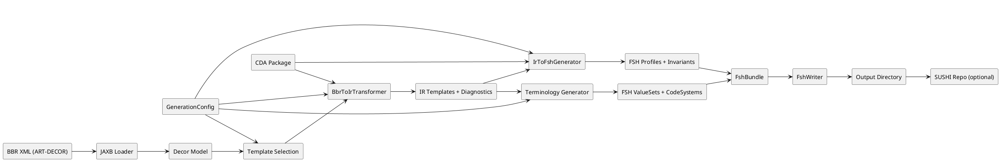

# End-to-end pipeline diagram

This diagram shows how the tool moves from BBR to IR to FSH, including the CDA package
and configuration inputs.

Notes:
- The CDA package is used both for validating/normalizing paths (BBR -> IR) and for
  base constraints (IR -> FSH).
- Terminology generation comes from the BBR `terminology` section and is merged with
  profile FSH output.
- CLI options and YAML config influence selection, naming, bindings, and invariant emission.
